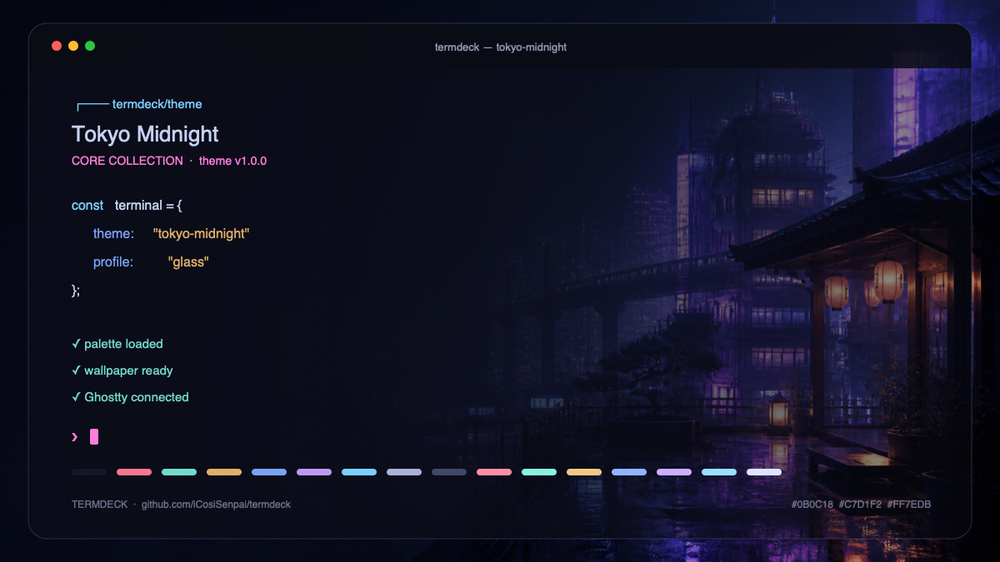
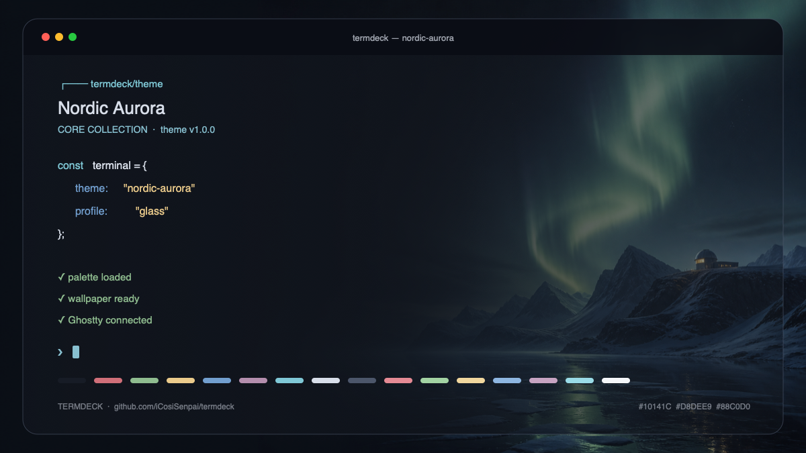
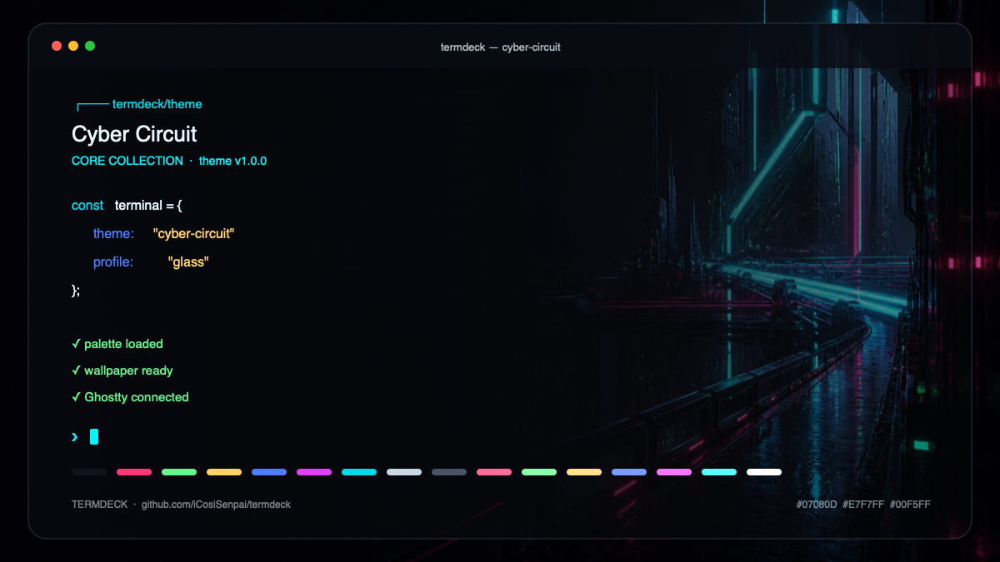
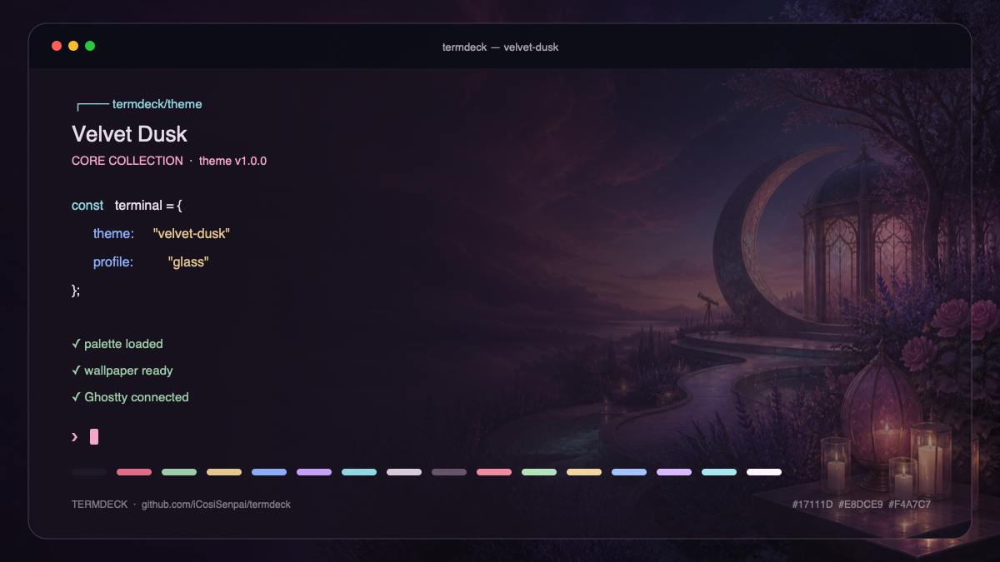
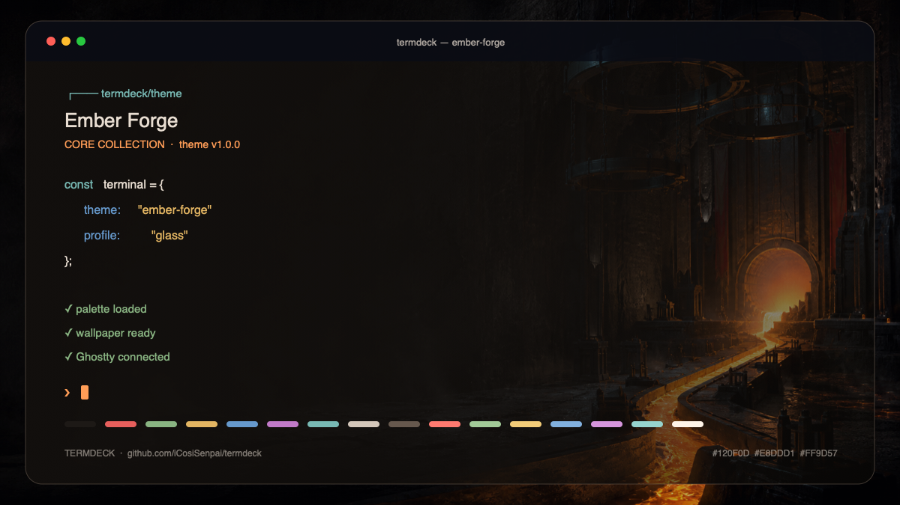
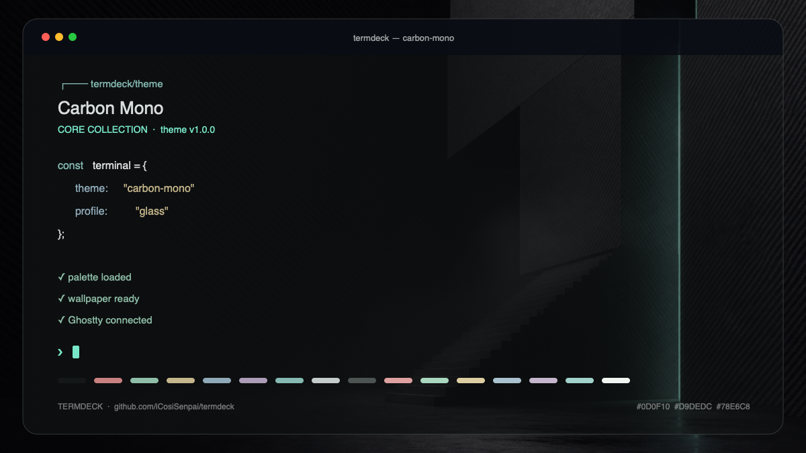
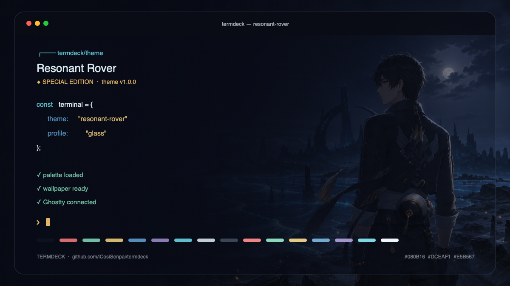
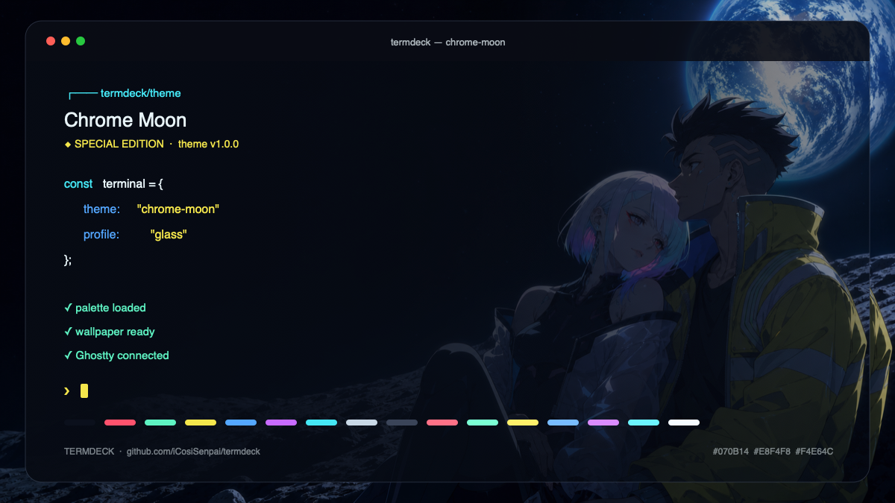

<div align="center">

#  TERMDECK

### Your terminal has settings. Termdeck gives it a control center.

**A cinematic theme deck, wallpaper system, and profile switcher built for Ghostty.**<br>
Browse visually. Preview safely. Apply only when it feels right.

[](https://github.com/iCosiSenpai/termdeck/releases/latest)
[](https://github.com/iCosiSenpai/termdeck/actions)
[](https://ghostty.org)
[](LICENSE)

[Install](#install) · [Control Center](#the-control-center) · [Theme Gallery](#theme-gallery) · [Portability](#one-deck-many-terminals) · [Contribute](CONTRIBUTING.md)

Created by [**Alessio Cosi**](https://github.com/iCosiSenpai) · [Repository](https://github.com/iCosiSenpai/termdeck) · [Latest release](https://github.com/iCosiSenpai/termdeck/releases/latest)

</div>



## Install

### Homebrew — recommended

```sh
brew install iCosiSenpai/tap/termdeck
termdeck
```

The qualified formula is the one-command installation route recommended for a new Homebrew tap. The shorter `brew install termdeck` becomes available once the project is accepted into Homebrew/core.

### Curl fallback

```sh
curl -fsSL https://raw.githubusercontent.com/iCosiSenpai/termdeck/main/install.sh | sh
termdeck
```

The fallback installer is intentionally small and auditable. It requires Node.js 20+, installs under `~/.local/share/termdeck`, creates a launcher in `~/.local/bin`, and preserves an existing installation as a timestamped backup.

## The Control Center

Running `termdeck` opens the full-screen deck. No theme names to memorize and no configuration file to hand-edit.

The **Terminal Profile** is the behavior layer applied on top of the selected theme. It controls opacity, blur, padding, cursor, titlebar, and inactive-pane treatment; changing profile does not change the palette, artwork, or your font size. Its selector sits inside the pane it changes, directly above the Live Preview, and the window reshapes itself as you switch: the title bar appears as a tab strip, as bare window buttons, or not at all; the content indents by the profile's padding; the cursor is drawn as a block, a bar, or a hollow block. Opacity and blur are stated as numbers rather than faked, because a terminal cannot be translucent inside another terminal.

| Key | Action |
| :---: | --- |
| <kbd>↑</kbd> <kbd>↓</kbd> | Browse Core Themes and Special Editions |
| <kbd>←</kbd> <kbd>→</kbd> | Switch the Terminal Profile: Cozy, Focus, Glass, or Presentation |
| <kbd>Enter</kbd> | Apply the selected theme and profile to Ghostty |
| <kbd>X</kbd> | Export the full native package for every supported terminal |
| <kbd>/</kbd> | Filter the catalog by typing; the query and its match count sit above the results, <kbd>Esc</kbd> clears |
| <kbd>R</kbd> | Pick a random look |
| <kbd>U</kbd> | Review the pending update, shown only when there is one |
| <kbd>?</kbd> | Open the built-in keyboard guide |
| <kbd>Q</kbd> | Close the Control Center; <kbd>Esc</kbd> does the same |

The deck states each thing once. The theme pane carries the name, version, description, palette, profile selector, and live window of the selection; the status row carries what is currently applied to Ghostty, or an invitation to press <kbd>Enter</kbd> when nothing is. Where the pane has rows to spare it also names the configuration file <kbd>Enter</kbd> would rewrite, so nothing changes on disk that you have not seen the path of. Themes are previewed without touching Ghostty until you press <kbd>Enter</kbd>.

Every row of the catalog is tinted by the theme it names — its accent, its green, and its magenta, the three colours that actually differ across the deck — and the selection is a chip painted in that theme's own background and accent, so the list reads as a set of samples rather than a column of labels.

The **Live Preview** pane draws a miniature terminal window using the selected theme's own background, foreground, cursor, and ANSI palette, so a theme is judged in context rather than as a row of colour chips. The window grows with the space available — from a three-line snippet to a full listing with the sixteen ANSI slots painted on the theme's own background — and falls back to palette swatches where the terminal cannot render real colour.

### Four profiles, every palette

| Profile | Designed for | Behavior |
| --- | --- | --- |
| **Cozy** | Everyday work | Soft translucency, balanced padding |
| **Focus** | Deep coding sessions | Solid contrast, hidden chrome, dim inactive splits |
| **Glass** | Desktop aesthetics | Frosted macOS blur and visible artwork |
| **Presentation** | Screen sharing | Solid background and generous spacing |

## Theme Gallery

Every theme ships with a purpose-built 16:9 wallpaper. The left side stays dark and low-detail for readable code; the visual focus lives on the right. Palette, wallpaper, metadata, and preview are versioned together.

### Core Collection

<table>
  <tr>
    <td width="50%" valign="top">
      
      <h3>Nordic Aurora <code>v1.0.0</code></h3>
      <p>Polar-night blues, glacial cyan, aurora green, and a silent observatory above a frozen fjord.</p>
    </td>
    <td width="50%" valign="top">
      
      <h3>Cyber Circuit <code>v1.0.0</code></h3>
      <p>Black glass, electric cyan, hot magenta, and a precise megastructure reflected in rain.</p>
    </td>
  </tr>
  <tr>
    <td width="50%" valign="top">
      
      <h3>Tokyo Midnight <code>v1.0.0</code></h3>
      <p>Rainy violet rooftops, elevated rails, quiet lantern light, and neon after midnight.</p>
    </td>
    <td width="50%" valign="top">
      
      <h3>Velvet Dusk <code>v1.0.0</code></h3>
      <p>Plum shadows, rose glass, lavender gardens, and warm candlelight at a dreamlike observatory.</p>
    </td>
  </tr>
  <tr>
    <td width="50%" valign="top">
      
      <h3>Ember Forge <code>v1.0.0</code></h3>
      <p>Charcoal basalt, molten orange, tempered steel, and disciplined late-night workshop energy.</p>
    </td>
    <td width="50%" valign="top">
      
      <h3>Carbon Mono <code>v1.0.0</code></h3>
      <p>Graphite architecture, monochrome restraint, carbon texture, and a single mint signal.</p>
    </td>
  </tr>
</table>

### ◆ Special Editions

Special Editions live in their own section at the bottom of the Control Center. They may explore games, characters, collaborations, events, or limited visual concepts while keeping the same usability standards as the Core Collection.

<table>
  <tr>
    <td width="50%" valign="top">
      
      <h3>Resonant Rover <code>v1.0.0</code></h3>
      <p>An unofficial <em>Wuthering Waves</em> fan edition: moonlit resonance, quiet gold, a distant coastal city, and Male Rover.</p>
    </td>
    <td width="50%" valign="top">
      
      <h3>Chrome Moon <code>v1.0.0</code></h3>
      <p>An unofficial <em>Cyberpunk: Edgerunners</em> fan edition: Lucy and David together on a lunar ridge beneath Earthlight.</p>
    </td>
  </tr>
</table>

## What a theme owns on Ghostty

Ghostty is the terminal Termdeck configures directly, and it exposes far more than sixteen colours. On Ghostty a theme is not a palette — it is the whole look of the application.

**Every surface Ghostty colours comes from the theme.** Beyond the background, foreground, cursor, selection and the sixteen ANSI slots, the deck also owns the character under the block cursor, the split divider, and both search highlights — the last of which would otherwise stay black-on-golden-yellow under all eight themes.

**The dock icon can match.** Ghostty lets its own macOS app icon be restyled, so `--icon` paints the ghost in the theme's accent and the little screen it holds as a gradient from that theme's background up to its selection tone:

```sh
termdeck apply tokyo-midnight --icon     # ghost #FF7EDB, screen #0B0C18 → #302A5C
termdeck apply tokyo-midnight --no-icon  # back to the official icon
```

Opt-in, remembered, and macOS-only — asked for anywhere else it writes nothing and says so. A theme can declare its own `icon` with a frame (`aluminum`, `beige`, `plastic`, `chrome`), a ghost colour, and up to sixty-four gradient stops.

**The catalog can live in Ghostty's own theme list.** `termdeck install-themes` publishes all eight where Ghostty looks for user themes, so they appear in `ghostty +list-themes` marked `(user)` and can be selected without Termdeck in the loop:

```sh
termdeck install-themes
ghostty +list-themes | grep Termdeck
```

```
theme = Termdeck Tokyo Midnight
theme = light:Termdeck Carbon Mono,dark:Termdeck Tokyo Midnight   # follows the system
```

Every published file is prefixed, because Ghostty ships 463 themes and searches your directory first — an unprefixed name would silently shadow one of them. `termdeck uninstall` takes back the prefixed files and leaves any theme you wrote yourself alone.

**Ghostty gets the last word before anything is written.** Termdeck asks `ghostty +validate-config` about the managed block on its own, and only a block Ghostty accepts reaches your configuration. A rejection arrives as Ghostty's own diagnostic, with your file never opened:

```
termdeck: Ghostty rejected the generated configuration: cursor-style: invalid value
"triangle", valid values are: bar, block, underline, block_hollow
```

The block is checked in isolation on purpose. Validating the merged file would fail on any unrelated mistake of your own and make Termdeck undo a good change to atone for it. Problems elsewhere in your configuration are reported, never repaired.

## One deck, many terminals

Termdeck exports the richest configuration each terminal can represent natively. The selected Cozy, Focus, Glass, or Presentation profile travels with the palette instead of being flattened into colors. Ghostty is applied for you; the other six are generated as packages you install once — see [Installing an exported package](#installing-an-exported-package).

| Terminal | Level | Art | Opacity / blur | Cursor | Chrome / layout | Panes | Package |
| --- | --- | :---: | :---: | :---: | :---: | :---: | --- |
| **Ghostty** | Full Experience | ✓ | ✓ | ✓ | ✓ | ✓ | `.conf` |
| **WezTerm** | Full Experience | ✓ | ✓ | ✓ | ✓ | ✓ | `.lua` |
| **Kitty** | Full Experience | ✓ | ✓ | ✓ | ✓ | ✓ | `.conf` |
| **iTerm2** | Visual Profile | ✓ | ✓ | ✓ | — | Global¹ | Dynamic Profile `.json` |
| **Apple Terminal** | Visual Profile | ✓ | ✓ | ✓ | — | — | `.terminal` |
| **Warp** | Visual Profile | ✓ | Global² | ✓ | Global² | Global² | `.yaml` + `.jpg` |
| **Alacritty** | Native Styling | —³ | ✓ | ✓ | ✓ | —³ | `.toml` |

1. iTerm2 split dimming and margins are application-wide preferences. Termdeck deliberately leaves those user-owned while its [Dynamic Profile](https://iterm2.com/documentation-dynamic-profiles.html) carries the wallpaper, blend, transparency, blur, cursor, and colors.
2. Warp theme YAML natively carries colors, cursor, and [JPEG background art](https://docs.warp.dev/terminal/appearance/custom-themes). Window opacity, blur, and pane dimming remain global Warp settings rather than theme fields.
3. The complete [Alacritty configuration reference](https://alacritty.org/config-alacritty.html) provides opacity, macOS blur, padding, decorations, and cursor settings but no background-image or native pane system. Termdeck does not fake either feature.

WezTerm receives a complete Lua configuration with background layers and inactive-pane treatment ([background layers](https://wezterm.org/config/lua/config/background.html)); Kitty receives image layout, tint, opacity, macOS blur, padding, decorations, cursor, and inactive-window styling ([Kitty configuration](https://sw.kovidgoyal.net/kitty/conf/)). Apple Terminal profiles support background images, transparency, blur, inactive-window effects, and cursor configuration ([Apple Terminal profile documentation](https://support.apple.com/guide/terminal/change-profiles-text-settings-trmltxt/mac)).

### Export packages

The Control Center exports all seven packages with <kbd>X</kbd>. A single target can be scripted with the same working profile:

```sh
termdeck export tokyo-midnight --target wezterm --profile glass
termdeck export nordic-aurora --target kitty --profile cozy
termdeck export resonant-rover --target warp --profile presentation
termdeck export chrome-moon --target wezterm --profile glass
termdeck capabilities
```

Every export places its wallpaper beside the generated configuration (or in an adjacent `assets/` directory) and writes an absolute path, so the file works from wherever you install it. Warp artwork is converted to JPEG, the format its documented theme schema uses for `background_image`; that conversion uses macOS `sips`, so exporting the Warp package requires macOS. `termdeck capabilities` prints the contract directly from the same capability registry used by the exporters.

### Installing an exported package

**Ghostty is the only terminal Termdeck configures for you.** `termdeck apply` writes its managed block directly, and says so plainly when Ghostty is not installed rather than reporting a success nothing will read. For the other six, `termdeck export` and <kbd>X</kbd> write a package into `./dist/<terminal>/` and stop there — Termdeck never edits another terminal's configuration on your behalf. Installing one is a single step:

| Terminal | Install the exported package |
| --- | --- |
| **Ghostty** | Automatic — `termdeck apply <theme>` |
| **iTerm2** | Copy the `.json` into `~/Library/Application Support/iTerm2/DynamicProfiles/`; the profile appears immediately, no restart |
| **Warp** | Copy **both** the `.yaml` and the `.jpg` into `~/.warp/themes/` — the theme references the image by name, relative to that directory |
| **Kitty** | Copy the `.conf` into `~/.config/kitty/` and add `include <file>.conf` to `kitty.conf` |
| **Alacritty** | Copy the `.toml` into `~/.config/alacritty/` and add it to `import` under `[general]` in `alacritty.toml` |
| **Apple Terminal** | `open <file>.terminal` to import the profile, then make it the default in Settings → Profiles |
| **WezTerm** | The `.lua` is a complete configuration: use it as `~/.config/wezterm/wezterm.lua`, or copy its `config.*` assignments into your existing one |

Alacritty loads the importing file last, so anything you set in your own `alacritty.toml` still wins over the imported theme.

## Safe by design

Termdeck does not replace your Ghostty configuration.

- It owns only a clearly marked managed block.
- It creates a backup before every change.
- Theme files and wallpaper assets are installed under `~/.config/termdeck`.
- `termdeck uninstall` removes the managed integration and keeps a recovery copy.
- Ghostty is asked to validate the managed block before your configuration is opened at all.
- Palette previews never modify the active terminal.
- Exported packages are written to `./dist/` and never installed into another terminal for you.
- Update checks only read a public release feed; nothing is installed without an explicit confirmation.

On macOS, Ghostty is managed at `~/Library/Application Support/com.mitchellh.ghostty/config`. Some opacity and titlebar changes can require a full Ghostty restart.

## Updates

Opening the Control Center checks for updates in the background. The first frame is never delayed by it: when an answer arrives, an alert names every version it would change and the exact command it would run.

- **Termdeck** is compared against the published release. The upgrade command follows how this copy was installed — Homebrew, the curl installer, or npm. A source checkout is reported and never modified.
- **Themes** are versioned independently. When the catalog has moved past the version recorded in your Ghostty config, the alert offers to apply it again.

Nothing is installed, downloaded, or re-applied until the alert is answered with <kbd>Y</kbd>. <kbd>N</kbd> postpones that release and keeps it one <kbd>U</kbd> away.

```sh
termdeck update          # check, report, and ask before changing anything
termdeck update --yes    # same, unattended
```

The check reads the public release feed once a day and caches the answer in `~/.config/termdeck/updates.json`. Setting `TERMDECK_NO_UPDATE_CHECK=1` turns it off entirely and leaves the local theme comparison as the only report.

## Versioning

Termdeck and every theme use independent [Semantic Versioning](https://semver.org/):

- **Termdeck version** tracks the application, dashboard, installers, and exporters.
- **Theme version** tracks palette, wallpaper, metadata, and visual tuning for that theme.
- Applied state records both versions, making screenshots and bug reports reproducible.

See the complete [changelog](CHANGELOG.md). The currently installed build can always identify itself with `termdeck version`.

<details>
<summary><strong>Power-user commands</strong></summary>

The visual Control Center is the default, but every action remains scriptable:

```sh
termdeck list
termdeck preview tokyo-midnight
termdeck apply nordic-aurora --profile focus
termdeck cycle --profile glass
termdeck random
termdeck export cyber-circuit --target iterm2 --profile glass
termdeck capabilities
termdeck status
termdeck update
termdeck doctor
termdeck uninstall
```

</details>

<details>
<summary><strong>Theme authoring and preview generation</strong></summary>

Theme definitions live in `themes/*.json` and require a SemVer version, category, order, wallpaper, provenance, foreground/background colors, cursor, selection colors, and exactly sixteen ANSI colors. An optional `icon` object overrides the Ghostty dock icon derived from the palette.

```sh
npm run previews
npm run notices
npm run check
```

`npm run previews` deterministically rebuilds every terminal screenshot from the real theme metadata and wallpaper. `npm run notices` generates the legal artwork inventory from that same catalog. Missing or incomplete provenance makes `npm run check` fail, so future themes cannot be added without attribution.

</details>

## Project

- **Release:** [v0.5.5](https://github.com/iCosiSenpai/termdeck/releases/tag/v0.5.5)
- **Repository:** [github.com/iCosiSenpai/termdeck](https://github.com/iCosiSenpai/termdeck)
- **Homebrew tap:** [github.com/iCosiSenpai/homebrew-tap](https://github.com/iCosiSenpai/homebrew-tap)
- **Author:** [github.com/iCosiSenpai](https://github.com/iCosiSenpai)
- **Issues and ideas:** [Termdeck issue tracker](https://github.com/iCosiSenpai/termdeck/issues)

Source code, Core Theme data, and original Core artwork are MIT licensed. Special Editions are unofficial fan works; third-party names, characters, marks, and source properties remain with their respective rights holders. Termdeck is not affiliated with or endorsed by those rights holders. Per-theme terms and attribution are generated from the catalog in the [wallpaper notice](assets/wallpapers/NOTICE.md).

<div align="center">

**Build a terminal worth looking at.**

[⭐ Star Termdeck](https://github.com/iCosiSenpai/termdeck) · [Follow @iCosiSenpai](https://github.com/iCosiSenpai)

</div>
