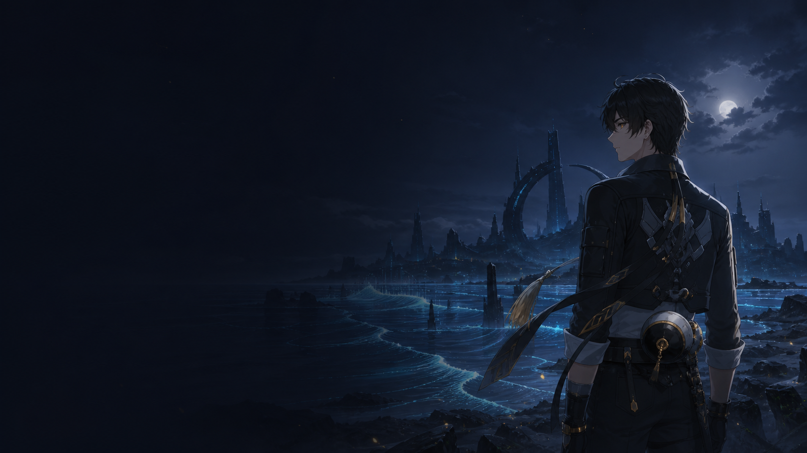

# Termdeck

**A cinematic theme deck and profile switcher for Ghostty.** Pick a palette, combine it with a working mode, and carry the same colors to the other terminal emulators you use.



Termdeck keeps color and behavior separate:

- **7 handcrafted themes**: Nordic Aurora, Cyber Circuit, Tokyo Midnight, Velvet Dusk, Ember Forge, Carbon Mono, and Resonant Rover.
- **4 working profiles**: `cozy`, `focus`, `glass`, and `presentation`.
- **Ghostty-native background images**, macOS blur, padding, cursor, split dimming, font override, and titlebar styling.
- **Safe config management**: only a marked block is owned by Termdeck, and the existing config is backed up before every change.
- **Portable exports** for Ghostty, iTerm2, Kitty, Alacritty, and WezTerm.
- **Fast switching** with `cycle` and `random`; no runtime dependencies beyond Node.js 20+.

## Install

Clone the repository, then link the CLI:

```sh
git clone https://github.com/iCosiSenpai/termdeck.git
cd termdeck
npm link
termdeck doctor
```

Termdeck uses Ghostty's macOS config at `~/Library/Application Support/com.mitchellh.ghostty/config`. It creates the file if it does not exist and never replaces settings outside its clearly marked managed block.

## Use

```sh
# Explore the deck
termdeck list
termdeck preview tokyo-midnight

# Apply colors plus a working mode
termdeck apply tokyo-midnight --profile glass
termdeck apply nordic-aurora --profile focus
termdeck apply resonant-rover --profile cozy --font "JetBrainsMono Nerd Font"

# Rotate without remembering names
termdeck cycle
termdeck random --profile glass

# Inspect or cleanly remove the integration
termdeck status
termdeck uninstall
```

Reload Ghostty with <kbd>⌘</kbd><kbd>⇧</kbd><kbd>,</kbd>. On macOS, opacity and titlebar changes may require closing Ghostty completely and reopening it.

## Working profiles

| Profile | Best for | Character |
| --- | --- | --- |
| `cozy` | Daily work | Gentle translucency, balanced padding |
| `focus` | Long coding sessions | Solid background, dim inactive splits, hidden chrome |
| `glass` | Desktop aesthetics | Frosted blur, translucent surface, visible artwork |
| `presentation` | Screen sharing | Large type, solid contrast, generous spacing |

The color theme and profile are independent, so every palette has four personalities. Pass `--font NAME` to set a Ghostty font without editing the source theme.

## Export to other terminals

```sh
termdeck export nordic-aurora --target iterm2
termdeck export cyber-circuit --target kitty
termdeck export tokyo-midnight --target alacritty
termdeck export velvet-dusk --target wezterm
termdeck export carbon-mono --target ghostty --output ./carbon.conf
```

Exports land in `dist/<terminal>/` unless `--output` is supplied. Color palettes are portable; effects such as Ghostty background images, Metal blur, titlebar modes, and split behavior are terminal-specific and therefore intentionally not embedded in the cross-terminal exports.

## Author a theme

Create `themes/my-theme.json` with foreground/background colors and exactly 16 ANSI palette entries. The catalog validates every theme at startup. Use an existing file as a starting point, then run:

```sh
npm test
termdeck preview my-theme
```

Wallpaper paths are project-relative. Keep the left side low-detail if the image will sit behind terminal text.

## Resonant Rover fan theme

`resonant-rover` is an unofficial fan-made theme inspired by *Wuthering Waves*. The wallpaper is an original AI-assisted composition made specifically for Termdeck—not a downloaded or repackaged third-party artwork. It is kept separate from the MIT-licensed source code; see [assets/wallpapers/NOTICE.md](assets/wallpapers/NOTICE.md).

Termdeck is not affiliated with or endorsed by Kuro Games. *Wuthering Waves* and its characters are property of their respective rights holders.

## License

Source code and theme data are released under the [MIT License](LICENSE). The fan-themed wallpaper is subject to the notice above.
